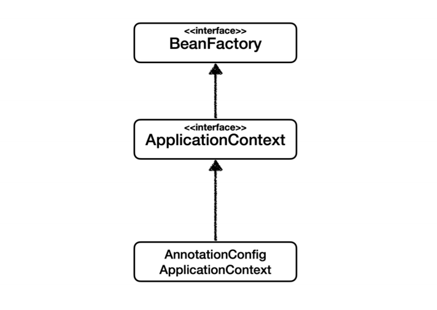
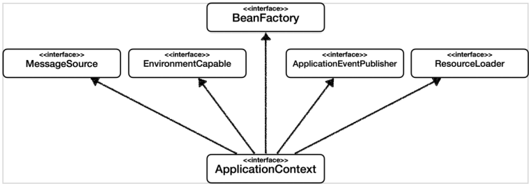

## 스프링 컨테이너

- 스프링 컨테이너 생성과정

  1. 스프링 컨테이너 생성

     - 스프링 컨테이너 생성하면 스프링 컨테이너가 만들어지고 빈 이름을 key, 빈 객체를 value로 가지는 스프링 컨테이너 내부에 스프링 빈 저장소가 만들어진다.
     - `AppConfig.class를` 구성 정보로 지정해준다.

     

  2. 스프링 빈 등록

     - AppConfig.class 구성 정보( `@Bean` )를 참고하여 스프링 빈 저장소를 채운다. 이 때 빈 이름은 구현체(메서드) 이름이, 빈 객체는 반환되는 객체가 들어간다.
     - 빈 이름은 항상 다른 이름을 부여해야 한다.

     

  3. 스프링 빈 의존관계 설정

     - 설정 정보(리턴되는 객체의 생성자)를 참고해서 의존관계를 주입한다.
     
     

- **Bean Factory**

  

  
  
  - 스프링 컨테이너의 최상위 인터페이스
  - 빈을 관리하고 조회하는 역할을 담당(`getBean()`을 제공)
  - 직접 사용할 일은 거의 없고 보통 ApplicationContext를 사용함


- **ApplicationContext**

  

  
  
  

  ```java
  ApplicationContext application = new AnnotationConfigApplicationContext(AppConfig.class);
  ```
  
  - `ApplicationContext`는인터페이스이고 `AnnotationConfigApplicationContext`는 구현체이다. 
  - 스프링 컨테이너는 XML 기반으로 만들 수도 있지만 보통 어노테이션 기반의 자바 설정 클래스로 만든다.
  - `BeanFactory`의 기능을 모두 상속받아서 제공하고 추가적으로 부가기능 제공
  - 메시지소스를 활용한 국제화 기능 (MessageSource)
    - 예) 접속 국가에 따라 다른 언어로 출력하는 웹사이트는 이 기능을 이용하여 파일을 여러 개로 분리해서 관리함
  - 환경변수 (EnvironmentCable)
    - 로컬, 개발, 운영,스테이지 환경을 구분해서 처리(DB를 따로 연결한다던지...)
  - 애플리케이션 이벤트(ApplicationEventPublisher)
    - 이벤트를 발행하고 구독하는 모델을 편리하게 지원
  - 편리한 리소스 조회(ResourceLoader)
    - 파일, 클래스패스, 외부 URL 등에서 리소스를 편리하게 조회
  - Bean Factory와 ApplicationContext를 스프링 컨테이너라고 한다.


- **BeanDefinition - 스프링 빈 설정 메타 정보**
  
  - 스프링이 자바와 XML 등의 다양한 설정 형식을 지원할 수 있는 이유 : `BeanDefinition`
  - 스프링 컨테이너는 자바 코드인지, XML인지 모르고 `BeanDefinition`만 안다.
    - `@Bean`, `<bean>` 당 하나씩 메타 정보가 생성된다.
    - 스프링 컨테이너는 메타 정보를 기반으로 스프링 빈을 생성한다.
  - BeanDefinition 정보 - 교재 pdf 참고
  - 깊이 있게 알 필요는 없다고 함
  
  

## 싱글톤 컨테이너

- 웹 어플리케이션과 싱글톤

  - 웹 어플리케이션은 여러 고객이 동시에 요청을 하고 싱글톤을 사용하지 않는다면 그 때마다 객체를 만든다는 문제가 있다. 이런 경우 메모리 낭비가 심하다.

  - 싱글톤 패턴은 클래스 인스턴스가 하나만 생성되는 것을 보장하는 디자인 패턴이다.

  - private 생성자를 사용해서 외부에서 임의로 new 키워드를 사용하지 못하도록 막는다.

  - 싱글톤 패턴을 구현하는 방법은 여러 가지가 있다. 객체를 미리 생성해두는 가장 단순하고 안전한 방법의 예시코드를 보자.

    ```java
    public class SingletonService {
         //1. static 영역에 객체를 딱 1개만 생성해둔다.
         private static final SingletonService instance = new SingletonService();
        
         //2. public으로 열어서 객체 인스터스가 필요하면 이 static 메서드를 통해서만 조회하도록 허용한
        다.
         public static SingletonService getInstance() {
         	return instance;
         }
        
         //3. 생성자를 private으로 선언해서 외부에서 new 키워드를 사용한 객체 생성을 못하게 막는다.
         private SingletonService() {
         }
         public void logic() {
         	System.out.println("싱글톤 객체 로직 호출");
         }
    }
    ```

  - 스프링 컨테이너를 쓰면 객체 생성시 편리하게 싱글톤으로 관리할 수 있다.

  

- 싱글톤 패턴 문제점

  - 싱글톤 패턴을 구현하는 코드 자체가 많이 들어간다.
  - 클라이언트가 구체 클래스에 의존하여 DIP를 위반(`구체클래스.getInstance()`)하게 되고 OCP를 위반할 가능성이 높아진다.
  - 유연성이 떨어진다.
    - 테스트하기 어렵다.
    - 내부 속성을 변경하거나 초기화하기 어렵다.
    - 자식클래스를 만들기 어렵다.
  - 안티패턴으로 불리기도 한다.

  - 스프링은 위의 문제점들을 해결하며 싱글톤을 사용할 수 있게 해준다.

    - 싱글톤 패턴을 위한 코드가 들어가지 않는다.
    - DIP, OCP, 테스트, private 생성자로부터 자유롭게 싱글톤을 사용할 수 있다.

  - 스프링 빈이 싱글톤으로 관리되는 빈이다.

  - 싱글톤 객체를 생성하고 관리하는 기능을 싱글톤 레지스트리라고 한다.

  - 스프링의 기본 빈 등록 방식은 싱글톤이지만 요청할 때 마다 새로운 객체를 생성해서 반환하는 기능도 제공한다.

    

- 싱글톤 방식의 **주의점**

  - 싱글톤 객체는 상태를 유지(stateful)하게 설계하면 안된다.
  - 무상태(stateless)로 설계해야 한다.
    - 특정 클라이언트에 의존적인 필드가 있으면 안된다.
    - 특정 클라이언트가 값을 변경할 수 있는 필드가 있으면 안된다.
    - 가급적 읽기만 가능해야 한다.
    - **필드 대신**에 자바에서 공유되지 않는 **지역변수, 파라미터, ThreadLocal 등을 사용**해야 한다.
  - 실무에서 종종 이로 인한 문제가 발생한다고함
  
  
  
- `@Configuration` 과 싱글톤

  - 스프링은 CGLIB라는 바이트코드 조작 라이브러리를 사용해서 AppConfig 클래스를 상속받은 임의의 다른 클래스를 만들고 그 다른 클래스를 스프링 빈으로 등록해서 싱글톤을 보장함
  - `@Bean`이 붙은 메서드마다 스프링 빈이 이미 존재하면 그것을 반환하고 없으면 새로 생성해서 스프링 빈으로 등록하고 반환하는 코드가 동적으로 만들어짐
  - `@Configuration`을 사용하지 않고 `@Bean`만 사용한다면 싱글톤이 깨진다.

  

## 컴포넌트 스캔

- 위에서 빈을 등록할 때는 자바 코드의 `@Bean`이나 XML의 `<bean>`등을 통해서 설정 정보에 직접 등록할 스프링 빈을 일일히 나열했다. 이런 작업은 스프링 빈이 많아진다면 반복적이기도 하고 코드가 길어진다.

- 스프링은 설정 정보가 없어도 자동으로 스프링 빈을 등록하는 `@ComponentScan`이라는 기능과 의존관계를 자동으로 주입하는 `@Autowired` 기능을 제공한다.

- `@Component` 가 붙은 클래스를 스캔해서 스프링 빈으로 등록한다. 이 때 스프링 빈의 기본 이름은 클래스명의 맨 앞글자만 소문자를 사용하고 나머지는 같다. 빈의 이름을 직접 정하고 싶다면 `@Component("name")`을 사용

- `@ComponentScan(basePackages=' ')`를 통해 탐색할 패키지의 시작 위치를 지정할 수 있다. 탐색 위치를 한정해서 스캔에 요구되는 시간을 줄일 수 있다.

- `@ComponentScan(basePackageClasses= )`를 통해 지정한 클래스의 패키지를 탐색 위치로 지정가능하다.

- 위의 두 방법을 사용하지 않는다면 `@ComponentScan`이 붙은 클래스의 패키지를 탐색 위치로 지정한다.

- 권장하는 방법 : 패캐지 위치를 지정하지 않고 설정 정보 클래스의 위치를 프로젝트 최상단에 둔다. 스프링 부트를 사용하면 스프링 부트의 대표 시작 정보인 `@SpringBootApplication`를 프로젝트 시작 루트 위치에 두는 것이 관례인데 이 안에 `@ComponentScan`이 들어 있다.

- `@Autowired`를 생성자에 붙여주면 의존관계를 자동으로 주입해준다.(파라미터의 타입을 통해 탐색한다.) 여러 의존관계도 한번에 가능하다.

- 컴포넌트 스캔 대상

  > `@Component` 
  >
  > `@Controller` : 스프링 MVC 컨트롤러로 인식
  >
  > `@Repository` : 스프링 데이터 접근 계층으로 인식하고 데이터 계층의 예외를 스프링 예외로 변환
  >
  > `@Configuration` : 스프링 설정 정보로 인식하고 싱글톤을 유지하도록 추가 처리
  >
  > `@Service` : 내부적으로 처리되는 것은 없고 개발자들이 핵심 비즈니스 로직으로 인식하도록 함

  - 애노테이션은 상속관계가 없다. 애노테이션이 특정 애노테이션을 포함하는 것을 인식할 수 있는 것은 자바의 기능이 아니라 스프링의 기능이다. 커스텀 애노테이션을 만들 수도 있다.

  

- 필터

  - `@ComponentScan(excludeFilters = @ComponentScan.Filter())`를 통해서 스캔 대상에서 제외할 대상을 정할 수 있다.

  - `@ComponentScan(includeFilters = @ComponentScan.Filter())`를 통해서 스캔 대상을 추가로 지정할 수 있다.

  - FilterType 옵션

    >- ANNOTATION (`@Filter(type = FilterType.ANNOTATION)` ) : 기본값, 애노테이션을 인식해서 동작
    >- ASSIGNABLE_TYPE : 지정한 타입과 자식 타입을 인식해서 동작
    >- ASPECTJ : AspectJ 패턴 사용
    >- REGEX : 정규 표현식
    >- CUSTOM : TypeFilter이라는 인터페이스를 구현해서 처리


- 중복 등록과 충돌
  - 자동 빈 등록 vs 자동 빈 등록 : `ConflictingBeanDefinitionException` 예외 발생
  - 수동 빈 등록 vs 자동 빈 등록
    - 스프링은 수동 빈이 자동 빈을 오버라이딩 해버린다.
    - 스프링 부트는 오류를 출력한다. application.properties에 `spring.main.allow-bean-definition-overriding=true`를 쓰면 오버라이딩으로 설정을 바꾼다.

## Java

- static

  - 클래스에 고정된 멤버로서 객체를 생성하지 않고 사용할 수 있는 필드와 메소드
  - 클래스 멤버라고도 하며 클래스 이름으로 접근해서 사용한다.
  
  

## References

- [스프링 핵심 원리 - 기본편](https://www.inflearn.com/course/스프링-핵심-원리-기본편/dashboard)
- 이것이 자바다 : 신용권의 Java 프로그래밍 정복

